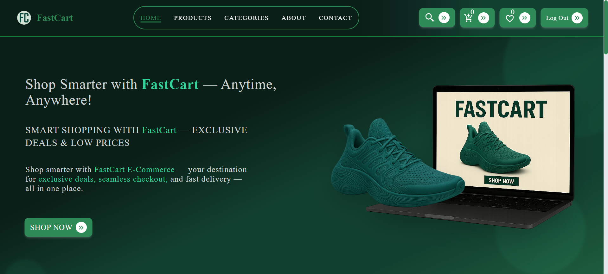
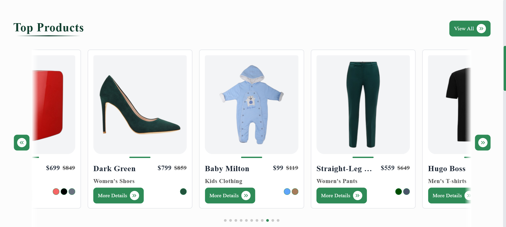
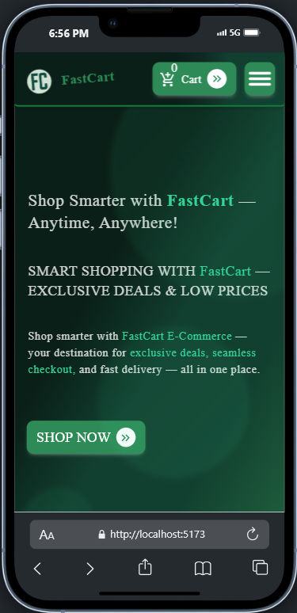
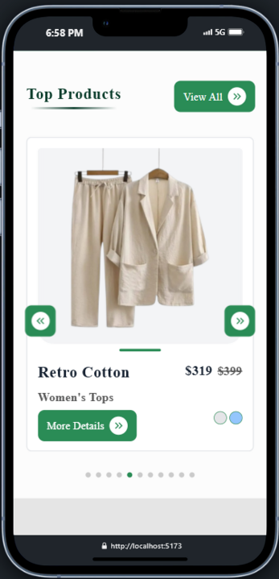

# 🛒 FastCart

**FastCart** is a high-performance eCommerce web application built using modern technologies. It offers an ultra-fast, user-friendly, and visually rich shopping experience. Whether browsing product images, watching variant-specific videos, or tracking real-time stock, FastCart delivers a seamless journey from discovery to checkout.

---

## 🚀 Live Preview

[](https://fast-cart-831t.vercel.app/)

---

## 🎯 Features

- ⚡ **Blazing Fast Performance** powered by React & Redux for seamless user experience  
- 🖼️ **Lazy Loading** of images and videos to optimize speed and improve UX  
- 🎥 **Dynamic Video Previews** on hover to showcase products vividly  
- 🎨 **Multiple Images Per Product** representing different color variants with real-time quantity tracking per variant  
- 📦 **Detailed Product Customization**: Users can select product color, size, and quantity effortlessly  
- 📐 **Integrated Size Guide** within product details to help customers confidently choose the perfect fit, reducing returns  
- 🔗 **Related Products Display** on product details page to boost cross-selling opportunities and user engagement  
- 🛒 **Intuitive Cart Management**: Users can update quantities directly in the cart for fast and flexible order adjustments  
- 💳 **Secure Checkout via Stripe**, ensuring smooth, reliable payment processing with global trust  
- 📄 **Instant Receipt Download** post-purchase, providing transparency and a professional buying experience  
- 💎 **Clean and Responsive UI/UX** crafted with Tailwind CSS for consistent performance across devices  
- 🔁 **Smooth Hover Animations** to enhance product interactivity and user engagement  
- 🔄 **Redux-powered Global State Management** for scalable and maintainable state handling  

---

## 🧠 Tech Stack

| Layer        | Tech Used                      |
|--------------|--------------------------------|
| Frontend     | React.js, Vite, TypeScript     |
| Styling      | Tailwind CSS                   |
| Animation    | Framer Motion                  |
| Media        | HTML5 Video, Lazy Load         |
| State Mgmt   | Redux Toolkit                  |
| Optimization | Lazy Rendering, Code Splitting |

---

## 🏗️ Project Structure

```
📦 FastCart
├── public                   # Static files (icons, images, videos)
│   └── ...
├── src
│   ├── assets/             
│   ├── components/          # Reusable and core UI components
│   ├── Data/                # Local product data
│   ├── Redux/               # Redux slices & store configuration
│   ├── App.tsx              # Root app component
│   ├── main.tsx             # App entry point
│   ├── index.css            # Global styles
│   ├── App.css              # Component-specific styles
│   └── main.jsx
├── .gitignore
├── README.md
├── LICENSE
├── SECURITY.md
├── package.json
└── vite.config.js
```

---

## 📸 Product Preview

Here’s a sneak peek of **FastCart** in action:

### 🖼️ Desktop View




### 📱 Mobile View




> 🎥 Want more? Hover animations, color variants, and dynamic video previews come alive in the full app!

---

## 💡 Performance Optimizations

- **Lazy Loading**: Reduces initial load time for media-heavy pages.
- **Responsive Design**: Mobile-first layout.
- **Preloading Strategies**: Efficient video preloading without overloading bandwidth.
- **Conditional Rendering**: Smooth transition effects with controlled opacity/z-index.

---

## 🛠️ Getting Started

1. Clone the repository:

```bash
https://github.com/Kyrillos-Samy1/FastCart.git
```

2. Navigate into the project:

```bash
cd FastCart
```

3. Install dependencies:

```bash
npm install
```

4. Run the development server:

```bash
npm run dev
```

---

## 🔐 Legal Notice & Usage Policy

This project is intended for **educational and portfolio purposes only**.  
All source code and media assets are owned and maintained by **Kyrillos Samy Doksh Hanna**.

🚫 **Unauthorized use, reproduction, or distribution of this code for commercial purposes is strictly prohibited**.

📄 Licensed under the [MIT License](./LICENSE).

> For commercial inquiries, collaborations, or special permissions, please get in touch with me directly at: `kyrillossamy@outlook.com`
---

## 📧 Contact

Built with 💚 by **Kyrillos Samy Doksh Hanna**  
📬 Email: [kyrillossamy@outlook.com](mailto:kyrillossamy@outlook.com)  
📱 Phone: +20-1271470997  
🧠 Nickname: `Empire Coder`  
🌍 Location: Egypt

---

> **Still learning, still building, always improving.**
